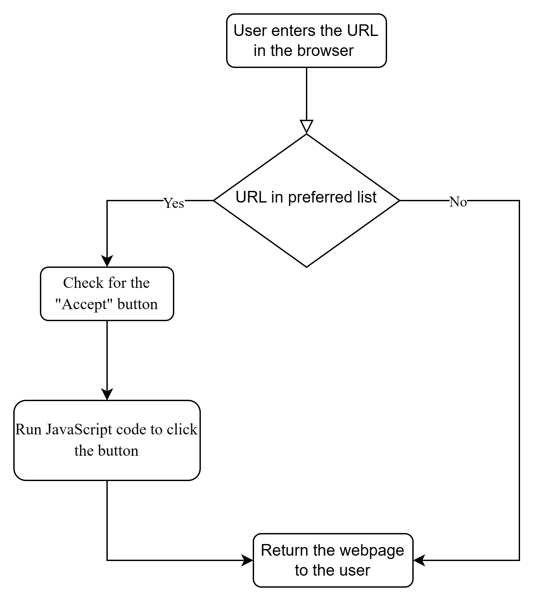

# Cookie Management
# Introduction
A cookie is a small piece of data that a website stores on your web browser when you visit it.
When you visit a website, the website may want to remember some information about you, such as your preferences. Your web browser then stores this cookie on your computer. It's like the website leaving a little note on your computer for later. The next time you visit the same website, your web browser sends the cookie back to the website. This helps the website remember your preferences or previous actions.
cookies are used to enhance your browsing experience by allowing websites to remember certain information about you. They are commonly used for purposes such as maintaining sessions, tracking user behavior, and personalizing content.

# Objective 
Add the cookie module to the simple browser to manage cookies easily. Whenever a user visits a website that sends a cookie, the user can respond to it depending on the legitimacy of the website. However, this project aims to allow the user to add the website to the safe list so that the browser will not ask whether the user wants to accept the cookie or not.

# Implementation
This diagram represent the approach of the project.

It asks users if they want to add the website to preferred list in the browser. 
We use PyQt5 python library to develop a simple browser and added the cookie management in it.
You can this [file](main.py)
