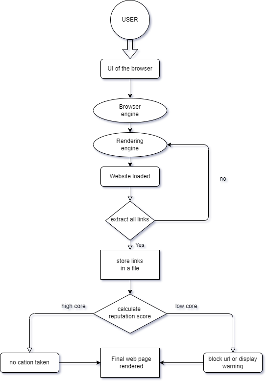
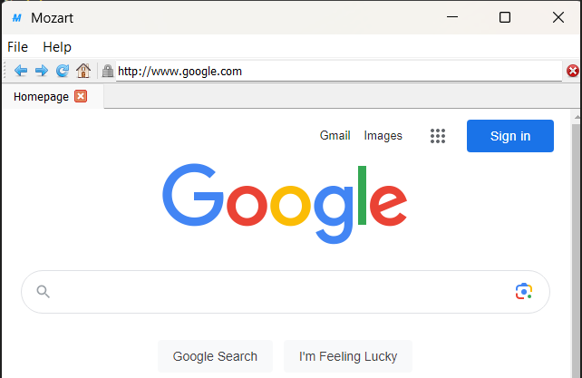
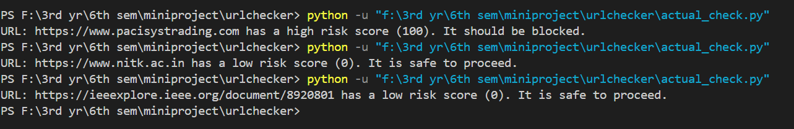

# Malicious URL Detection APIVoid
## Introduction
Phishing is a cyber-attack where attackers try to trick individuals into revealing sensitive information such as passwords, credit card numbers, or other personal data. This is usually done by impersonating a trustworthy entity, such as a bank, government agency, or well-known company, through email, text messages, or fraudulent websites.
The phishing messages often contain links to fake websites that look legitimate but are designed to steal your information when you enter it. They may also contain attachments that, when opened, install malware on your device.

## Objective
Implement phishing detection in a basic web browser application. Utilize a reputation-based detector API provided by APIVoid.com to assess the risk scores of URLs and identify potentially malicious ones.

## Implementation



* User initiates the process by requesting a web page from a web server.
* Client (User's Browser) retrieves and displays the web page content.
* Extract all links and store them in a file.
* Calculate the score of the URL. If it is high, then no action will be taken. If the score is low, then block the URL.

This project used Mozart browser, which uses the PyQt5 Python library to develop a simple browser. In this folder, you can see [mozart.py](mozart.py), a modified version of the Mozart browser with the added URL extraction feature.


## Steps to run code

To install the project dependencies and set up the environment, follow these steps:

1. **Clone the Repository:**

   ```bash
   git clone https://github.com/htoukour/Mozart.git
   pip3 install -r requirements.txt
2. Replace Mozart.py file with [mozart.py](mozart.py) and download [check.py](check.py) in the Mozart folder.
3. You must generate the API key from [apivoid](https://www.apivoid.com/api/url-reputation/).
4. Once you generate the API key change in [check.py](check.py).
5. Run the following command
6. ```bash
   python3 mozart.py
7. You will get this [page](Images/mozart.png) and search any website, and then you will get a text file (hyperlinks.txt) that contains all the links on the page.
8. Run the check.py and pass the link to it.

## Output


